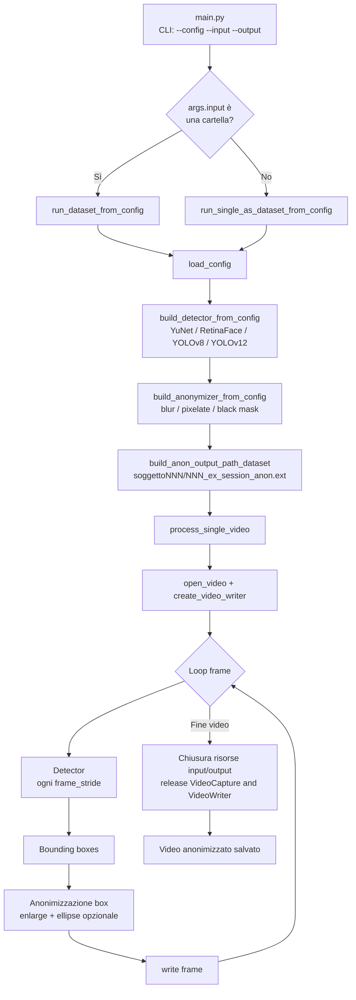

# Video Anonymization Pipeline

Pipeline modulare per l'anonimizzazione di video tramite rilevatori di volto (YuNet, RetinaFace, YOLOv8-face, YOLOv12-face) e diverse tecniche di anonimizzazione (blur, pixelate, black mask), configurabile tramite file YAML.

La struttura del progetto è estensibile, i componenti sono separati per funzionalità (detector, anonymizer, utilità I/O, organizzazione dataset) ed è presente un unico `main.py` come entry point.

---

## Struttura del progetto

Schema semplificato delle cartelle principali:

```text
project/
│  main.py                     # entry-point CLI della pipeline
│  README.md
│
├─ config/
│   └─ config.yaml             # configurazione detector, anonymizer e pipeline
│
├─ data/
│   ├─ input/
│   │   └─ videos/             # video grezzi originali
│   │
│   ├─ organized_videos/       # video rinominati/normalizzati
│   │
│   ├─ output/
│   │   └─ videos/             # video anonimizzati 
│   │
│   ├─ ground_truth/           # annotazioni GT per valutazione detector
│   │
│   ├─ predictions/            # output grezzo dei detector (per benchmark)
│   │
│   ├─ results/                # metriche aggregate (CSV / XLSX / grafici)
│   │
│   └─ samples/                # esempi, subset o materiale di debug
│
├─ models/
│   ├─ yunet/
│   │   └─ face_detection_yunet_2023mar.onnx
│   ├─ yolov8/
│   │   └─ yolov8n-face.pt
│   └─ yolov12/
│       └─ yolov12n-face.pt
│
├─ scripts/
│   └─ run_benchmark_detector.py   # script per valutazione detector
│
├─ src/
│   ├─ detectors/
│   │   ├─ yolo/
│   │   │   ├─ yolov8_detector.py
│   │   │   └─ yolov12_detector.py
│   │   ├─ yunet_detector.py
│   │   └─ retinaFace_detector.py
│   │
│   ├─ anonymizers/
│   │   ├─ gaussian_blur.py
│   │   ├─ pixelation.py
│   │   └─ black_mask.py
│   │
│   ├─ pipeline/
│   │   └─ video_pipeline.py   # core pipeline di elaborazione e anonimizzazione
│   │
│   ├─ evaluation/
│   │   ├─ ground_truth_loader.py
│   │   └─ metrics.py
│   │
│   └─ utils/
│       ├─ io_utils.py
│       ├─ boxes_enlarge.py
│       ├─ dataset_organizer.py
│       └─ draw_utils.py        # opzionale, solo per debug/visualizzazione

```

# Diagramma di flusso della pipeline


